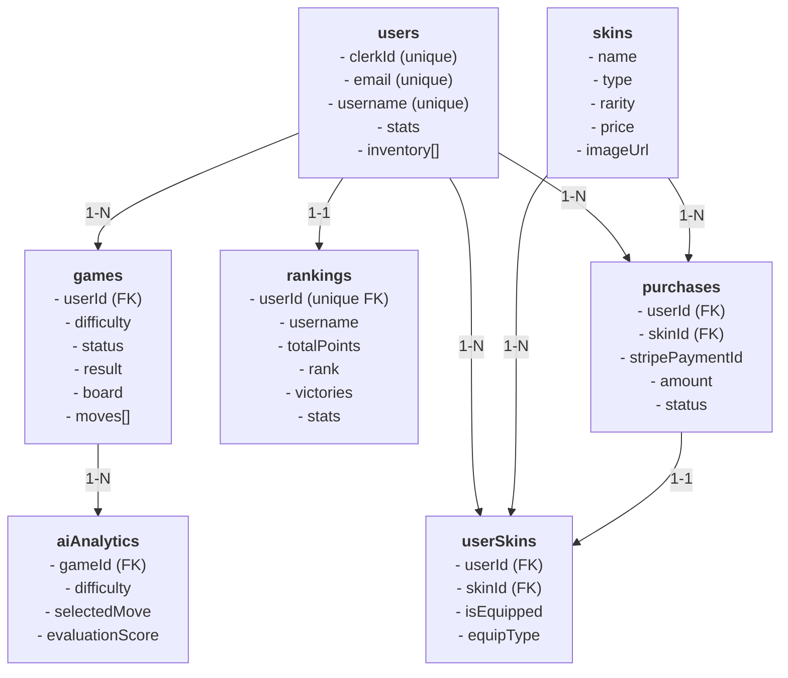

# 📊 Diagrama de Relaciones - Base de Datos Damas

**Última actualización:** 26 de mayo de 2026

## 🏗️ Arquitectura de Datos



## 🔍 Relaciones Detalladas

### 1️⃣ Users ↔ Games (1-N)
**Descripción:** Un usuario puede tener múltiples partidas

**Foreign Key:**
```javascript
// En games
{ userId: ObjectId("507f...") }
```

**Queries:**
```javascript
// Obtener todas las partidas de un usuario
db.games.find({ userId: ObjectId("...") })

// Obtener partidas activas
db.games.find({ userId: ObjectId("..."), status: "active" })
```

### 2️⃣ Users ↔ Rankings (1-1)
**Descripción:** Cada usuario tiene exactamente un documento de ranking

**Foreign Key:**
```javascript
// En rankings (unique)
{ userId: ObjectId("507f...") }
```

**Queries:**
```javascript
// Obtener ranking de usuario
db.rankings.findOne({ userId: ObjectId("...") })

// Actualizar ranking después de partida
db.rankings.updateOne(
  { userId: ObjectId("...") },
  { $inc: { victories: 1, totalPoints: 50 } }
)
```

**Propósito:** Desnormalización para consultas de ranking rápidas sin aggregation

### 3️⃣ Users ↔ Purchases (1-N)
**Descripción:** Un usuario puede realizar múltiples compras

**Foreign Key:**
```javascript
// En purchases
{ userId: ObjectId("507f...") }
```

**Queries:**
```javascript
// Historial de compras
db.purchases.find({ userId: ObjectId("...") })
  .sort({ purchasedAt: -1 })

// Compras completadas
db.purchases.find({
  userId: ObjectId("..."),
  status: "completed"
})
```

### 4️⃣ Users ↔ UserSkins (1-N)
**Descripción:** Un usuario puede tener múltiples skins en su inventario

**Foreign Keys:**
```javascript
// En userSkins
{ 
  userId: ObjectId("507f..."),
  skinId: ObjectId("607f...")
}
```

**Queries:**
```javascript
// Inventario completo del usuario
db.userSkins.find({ userId: ObjectId("...") })

// Skins equipados
db.userSkins.find({
  userId: ObjectId("..."),
  isEquipped: true
})

// Skins equipados por tipo
db.userSkins.find({
  userId: ObjectId("..."),
  isEquipped: true,
  equipType: "piece"
})
```

### 5️⃣ Users ↔ Skins (M-N)
**Descripción:** Muchos usuarios pueden comprar muchos skins (through userSkins)

**Path:**
```
users
  ↓ (via userSkins)
skins
```

**Queries:**
```javascript
// Obtener todos los skins de un usuario
db.userSkins.find({ userId: ObjectId("...") })
  .lookup({
    from: "skins",
    localField: "skinId",
    foreignField: "_id",
    as: "skin"
  })

// Verificar si usuario posee un skin específico
db.userSkins.findOne({
  userId: ObjectId("..."),
  skinId: ObjectId("...")
})
```

### 6️⃣ Games ↔ AIAnalytics (1-N)
**Descripción:** Cada partida puede tener múltiples registros de análisis IA

**Foreign Key:**
```javascript
// En aiAnalytics
{ gameId: ObjectId("607f...") }
```

**Queries:**
```javascript
// Obtener análisis de una partida
db.aiAnalytics.find({ gameId: ObjectId("...") })
  .sort({ moveNumber: 1 })

// Análisis de movimiento específico
db.aiAnalytics.findOne({
  gameId: ObjectId("..."),
  moveNumber: 5
})

// Rendimiento de IA por dificultad
db.aiAnalytics.aggregate([
  { $match: { difficulty: "master" } },
  { $group: {
      _id: null,
      avgExecutionTime: { $avg: "$executionTime" },
      avgSearchDepth: { $avg: "$searchDepth" }
    }
  }
])
```

### 7️⃣ Skins ↔ Purchases (1-N)
**Descripción:** Un skin puede ser comprado por múltiples usuarios

**Foreign Key:**
```javascript
// En purchases
{ skinId: ObjectId("607f...") }
```

**Queries:**
```javascript
// Todas las compras de un skin
db.purchases.find({ skinId: ObjectId("...") })

// Skin más vendido
db.skins.findOne({}, { sort: { soldCount: -1 } })

// Ingresos por skin
db.purchases.aggregate([
  { $match: { skinId: ObjectId("..."), status: "completed" } },
  { $group: {
      _id: "$skinId",
      totalRevenue: { $sum: "$amount" },
      purchaseCount: { $sum: 1 }
    }
  }
])
```

### 8️⃣ Skins ↔ UserSkins (1-N)
**Descripción:** Un skin puede estar en el inventario de múltiples usuarios

**Foreign Key:**
```javascript
// En userSkins
{ skinId: ObjectId("607f...") }
```

**Queries:**
```javascript
// Cuántos usuarios tienen este skin
db.userSkins.countDocuments({ skinId: ObjectId("...") })

// Usuarios que tienen este skin equipado
db.userSkins.find({
  skinId: ObjectId("..."),
  isEquipped: true
})
```

### 9️⃣ Purchases ↔ UserSkins (1-1 optional)
**Descripción:** Una compra se puede vincular a un registro userSkin

**Foreign Key:**
```javascript
// En userSkins (opcional)
{ purchaseId: ObjectId("707f...") }
```

**Flujo:**
1. Usuario compra un skin → se crea compra
2. Se crea/actualiza registro en userSkins
3. UserSkin tiene referencia a Purchase para auditoría

## 📈 Queries Complejas

### Obtener Top 10 Jugadores con sus Skins Equipados

```javascript
db.rankings.aggregate([
  { $sort: { totalPoints: -1 } },
  { $limit: 10 },
  { $lookup: {
      from: "users",
      localField: "userId",
      foreignField: "_id",
      as: "user"
    }
  },
  { $lookup: {
      from: "userSkins",
      let: { userId: "$userId" },
      pipeline: [
        { $match: { $expr: { $eq: ["$userId", "$$userId"] }, isEquipped: true } },
        { $lookup: {
            from: "skins",
            localField: "skinId",
            foreignField: "_id",
            as: "skin"
          }
        }
      ],
      as: "equippedSkins"
    }
  },
  { $project: {
      username: 1,
      totalPoints: 1,
      victories: 1,
      equippedSkins: { "skin.0": 1 }
    }
  }
])
```

### Historial Completo de Partida de Usuario

```javascript
db.games.aggregate([
  { $match: { userId: ObjectId("...") } },
  { $sort: { createdAt: -1 } },
  { $limit: 20 },
  { $lookup: {
      from: "users",
      localField: "userId",
      foreignField: "_id",
      as: "player"
    }
  },
  { $lookup: {
      from: "aiAnalytics",
      localField: "_id",
      foreignField: "gameId",
      as: "aiMoves"
    }
  },
  { $lookup: {
      from: "userSkins",
      let: { userId: "$userId", skinId: "$playerSkinId" },
      pipeline: [
        { $match: { $expr: { $and: [
            { $eq: ["$userId", "$$userId"] },
            { $eq: ["$skinId", "$$skinId"] }
          ]}}
        },
        { $lookup: {
            from: "skins",
            localField: "skinId",
            foreignField: "_id",
            as: "skin"
          }
        }
      ],
      as: "playerSkinInfo"
    }
  },
  { $project: {
      result: 1,
      difficulty: 1,
      duration: 1,
      pointsEarned: 1,
      moves: { $size: "$moves" },
      playerName: { $arrayElemAt: ["$player.username", 0] },
      playerSkin: { $arrayElemAt: ["$playerSkinInfo.skin.0.name", 0] },
      aiMovesCount: { $size: "$aiMoves" }
    }
  }
])
```

### Análisis de Desempeño de Usuario por Dificultad

```javascript
db.games.aggregate([
  { $match: { userId: ObjectId("...") } },
  { $group: {
      _id: "$difficulty",
      victories: {
        $sum: { $cond: [{ $eq: ["$result", "victory"] }, 1, 0] }
      },
      defeats: {
        $sum: { $cond: [{ $eq: ["$result", "defeat"] }, 1, 0] }
      },
      avgDuration: { $avg: "$duration" },
      avgMoves: { $avg: "$totalMoves" },
      totalPoints: { $sum: "$pointsEarned" }
    }
  },
  { $sort: { _id: 1 } }
])
```

## 📊 Estadísticas y Agregaciones

### Estadísticas Globales

```javascript
db.games.aggregate([
  { $group: {
      _id: null,
      totalGames: { $sum: 1 },
      avgDuration: { $avg: "$duration" },
      totalMovements: { $sum: "$totalMoves" },
      completedGames: {
        $sum: { $cond: [{ $eq: ["$status", "completed"] }, 1, 0] }
      }
    }
  }
])
```

### Skins Más Populares

```javascript
db.userSkins.aggregate([
  { $group: {
      _id: "$skinId",
      owners: { $sum: 1 },
      equippedCount: {
        $sum: { $cond: ["$isEquipped", 1, 0] }
      }
    }
  },
  { $lookup: {
      from: "skins",
      localField: "_id",
      foreignField: "_id",
      as: "skin"
    }
  },
  { $sort: { owners: -1 } },
  { $limit: 10 },
  { $project: {
      skinName: { $arrayElemAt: ["$skin.name", 0] },
      owners: 1,
      equippedCount: 1
    }
  }
])
```

## 🔒 Integridad Referencial

**Nota:** MongoDB no tiene foreign keys nativos. La integridad se mantiene en la aplicación:

1. **Validación de existencia:** Antes de insertar, verificar que FK existe
2. **Eliminación en cascada:** Al eliminar usuario, eliminar sus referencias
3. **Transacciones:** Para operaciones multi-documento críticas

Ejemplo:
```typescript
// Antes de crear purchase
const userExists = await users.findOne({ _id: userId })
const skinExists = await skins.findOne({ _id: skinId })

if (!userExists || !skinExists) {
  throw new Error('Invalid userId or skinId')
}

// Crear purchase
await purchases.insertOne(purchase)
```

---

**Versión:** 1.0.0
