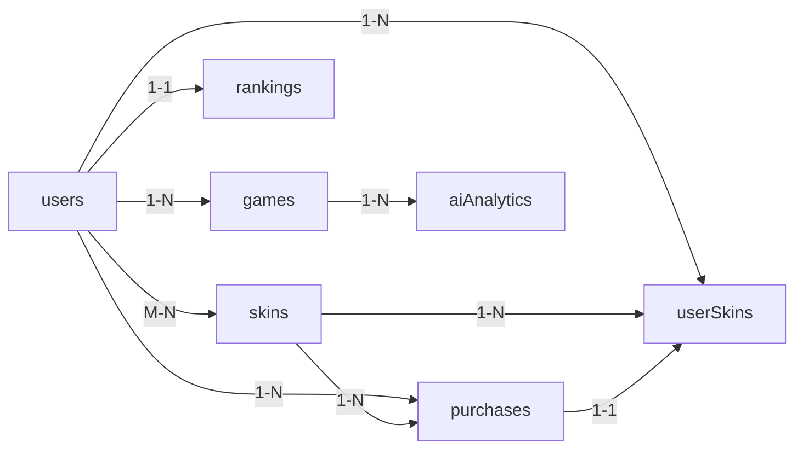

# 📊 Documentación de Base de Datos - Damas

**Última actualización:** 26 de mayo de 2026  
**Motor:** MongoDB 7.0  
**Tipo:** NoSQL Documental  

---

## 📋 Tabla de Contenidos

1. [Descripción General](#descripción-general)
2. [Colecciones](#colecciones)
3. [Relaciones](#relaciones)
4. [Índices](#índices)
5. [Ejemplos de Documentos](#ejemplos-de-documentos)
6. [Operaciones Comunes](#operaciones-comunes)

---

## 🎯 Descripción General

La base de datos de Damas está diseñada con modelo **Stateless** utilizando:
- **7 colecciones principales** para almacenar datos del juego
- **Índices estratégicos** para optimizar queries frecuentes
- **Validación con Zod** en la capa de aplicación
- **Relaciones mediante ObjectId** para mantener integridad referencial

---

## 📁 Colecciones

### 1. **users** - Usuarios del Sistema

Almacena información de usuarios autenticados con Clerk.

**Ubicación del modelo:** `backend/src/models/User.ts`

**Campos:**
| Campo | Tipo | Descripción | Único |
|-------|------|-------------|-------|
| `_id` | ObjectId | ID primario | ✅ |
| `clerkId` | String | ID de Clerk | ✅ |
| `email` | String | Email del usuario | ✅ |
| `username` | String | Nombre de usuario | ✅ |
| `firstName` | String? | Nombre | ❌ |
| `lastName` | String? | Apellido | ❌ |
| `avatar` | String(URL)? | URL del avatar | ❌ |
| `stats` | Object | Estadísticas del jugador | ❌ |
| `stats.totalVictories` | Number | Total de victorias | ❌ |
| `stats.totalDefeats` | Number | Total de derrotas | ❌ |
| `stats.totalDraws` | Number | Total de empates | ❌ |
| `stats.totalGames` | Number | Total de partidas | ❌ |
| `stats.totalPoints` | Number | Puntos acumulados | ❌ |
| `stats.winRate` | Number | Porcentaje de victorias | ❌ |
| `stats.averageMovements` | Number | Promedio de movimientos | ❌ |
| `stats.bestStreak` | Number | Mejor racha de victorias | ❌ |
| `stats.currentStreak` | Number | Racha actual | ❌ |
| `inventory` | Array[ObjectId] | IDs de skins compradas | ❌ |
| `createdAt` | Date | Fecha de creación | ❌ |
| `updatedAt` | Date | Fecha de actualización | ❌ |
| `lastLoginAt` | Date? | Último login | ❌ |
| `isActive` | Boolean | Usuario activo | ❌ |

**Índices:**
```javascript
{ clerkId: 1 } - unique
{ email: 1 } - unique
{ username: 1 } - unique
{ 'stats.totalPoints': -1 } - para rankings
{ createdAt: -1 }
{ isActive: 1 }
```

**Ejemplo:**
```json
{
  "_id": ObjectId("507f1f77bcf86cd799439011"),
  "clerkId": "user_29w83jdikejdiej",
  "email": "jugador@example.com",
  "username": "JugadorPro",
  "firstName": "Juan",
  "lastName": "Pérez",
  "avatar": "https://cdn.example.com/avatars/user123.jpg",
  "stats": {
    "totalVictories": 42,
    "totalDefeats": 18,
    "totalDraws": 2,
    "totalGames": 62,
    "totalPoints": 4280,
    "winRate": 67.7,
    "averageMovements": 28.5,
    "bestStreak": 12,
    "currentStreak": 3
  },
  "inventory": [
    ObjectId("507f1f77bcf86cd799439012"),
    ObjectId("507f1f77bcf86cd799439013")
  ],
  "createdAt": "2026-05-15T10:30:00Z",
  "updatedAt": "2026-05-26T14:22:00Z",
  "lastLoginAt": "2026-05-26T09:15:00Z",
  "isActive": true
}
```

---

### 2. **games** - Historial de Partidas

Almacena todas las partidas jugadas, activas y completadas.

**Ubicación del modelo:** `backend/src/models/Game.ts`

**Campos:**
| Campo | Tipo | Descripción |
|-------|------|-------------|
| `_id` | ObjectId | ID primario |
| `userId` | ObjectId | Referencia a User |
| `difficulty` | String | Nivel: beginner, intermediate, master, ultra |
| `status` | String | Estado: active, completed, abandoned |
| `result` | String? | Resultado: victory, defeat, draw |
| `board` | Array[8][8] | Estado del tablero 8x8 |
| `moves` | Array[Object] | Movimientos realizados |
| `moves[].from` | Array[2] | Posición origen [row, col] |
| `moves[].to` | Array[2] | Posición destino [row, col] |
| `moves[].capturedPieces` | Array? | Piezas capturadas en ese movimiento |
| `moves[].movedAt` | Date | Timestamp del movimiento |
| `totalMoves` | Number | Total de movimientos en partida |
| `playerMoves` | Number | Movimientos del jugador |
| `aiMoves` | Number | Movimientos de la IA |
| `duration` | Number? | Duración en segundos |
| `pointsEarned` | Number? | Puntos ganados |
| `playerSkinId` | ObjectId? | Referencia a skin usado |
| `aiSkinId` | ObjectId? | Skin de la IA |
| `createdAt` | Date | Inicio de partida |
| `updatedAt` | Date | Última actualización |
| `completedAt` | Date? | Fin de partida |

**Índices:**
```javascript
{ userId: 1 } - queries por usuario
{ status: 1 } - filtrar activas
{ createdAt: -1 } - orden cronológico
{ difficulty: 1 } - análisis por nivel
{ result: 1 }
{ userId: 1, createdAt: -1 } - historial de usuario
```

**Ejemplo:**
```json
{
  "_id": ObjectId("607f1f77bcf86cd799439020"),
  "userId": ObjectId("507f1f77bcf86cd799439011"),
  "difficulty": "intermediate",
  "status": "completed",
  "result": "victory",
  "board": [[...]],
  "moves": [
    {
      "from": [5, 2],
      "to": [4, 3],
      "movedAt": "2026-05-26T15:30:00Z"
    }
  ],
  "totalMoves": 42,
  "playerMoves": 21,
  "aiMoves": 21,
  "duration": 1245,
  "pointsEarned": 450,
  "createdAt": "2026-05-26T15:20:00Z",
  "completedAt": "2026-05-26T15:40:45Z"
}
```

---

### 3. **rankings** - Tabla de Rankings

Tabla desnormalizada para rankings rápidos. Se actualiza después de cada partida.

**Ubicación del modelo:** `backend/src/models/Ranking.ts`

**Campos:**
| Campo | Tipo | Descripción |
|-------|------|-------------|
| `_id` | ObjectId | ID primario |
| `userId` | ObjectId | Referencia única a User |
| `username` | String | Nombre de usuario (desnormalizado) |
| `totalPoints` | Number | Puntos totales |
| `rank` | Number? | Posición en ranking |
| `victories` | Number | Total de victorias |
| `totalGames` | Number | Total de partidas |
| `winRate` | Number | Porcentaje de victorias |
| `averageMovements` | Number | Promedio de movimientos |
| `victoriesByDifficulty` | Object | Victorias por dificultad |
| `victoriesByDifficulty.beginner` | Number | Victorias en beginner |
| `victoriesByDifficulty.intermediate` | Number | Victorias en intermediate |
| `victoriesByDifficulty.master` | Number | Victorias en master |
| `victoriesByDifficulty.ultra` | Number | Victorias en ultra |
| `bestStreak` | Number | Mejor racha |
| `currentStreak` | Number | Racha actual |
| `createdAt` | Date | Fecha de creación |
| `updatedAt` | Date | Última actualización |
| `lastGameAt` | Date? | Última partida |

**Índices:**
```javascript
{ userId: 1 } - unique, lookup por usuario
{ totalPoints: -1 } - ranking ordenado por puntos
{ rank: 1 }
{ updatedAt: -1 } - cambios recientes
{ winRate: -1 }
```

**Ejemplo:**
```json
{
  "_id": ObjectId("607f1f77bcf86cd799439030"),
  "userId": ObjectId("507f1f77bcf86cd799439011"),
  "username": "JugadorPro",
  "totalPoints": 4280,
  "rank": 7,
  "victories": 42,
  "totalGames": 62,
  "winRate": 67.7,
  "averageMovements": 28.5,
  "victoriesByDifficulty": {
    "beginner": 12,
    "intermediate": 18,
    "master": 10,
    "ultra": 2
  },
  "bestStreak": 12,
  "currentStreak": 3,
  "updatedAt": "2026-05-26T15:40:45Z"
}
```

---

### 4. **skins** - Catálogo de Skins

Catálogo de todas las skins disponibles para comprar.

**Ubicación del modelo:** `backend/src/models/Skin.ts`

**Campos:**
| Campo | Tipo | Descripción |
|-------|------|-------------|
| `_id` | ObjectId | ID primario |
| `name` | String | Nombre del skin |
| `description` | String? | Descripción |
| `type` | String | piece, board, piece_and_board |
| `rarity` | String | common, uncommon, rare, epic, legendary |
| `price` | Number | Precio en centavos |
| `currency` | String | USD, EUR, MXN |
| `imageUrl` | String(URL) | URL de imagen |
| `previewUrl` | String(URL)? | URL de preview |
| `primaryColor` | String(Hex)? | Color primario #RRGGBB |
| `secondaryColor` | String(Hex)? | Color secundario #RRGGBB |
| `isActive` | Boolean | Disponible para compra |
| `isLimited` | Boolean | Edición limitada |
| `limitedQuantity` | Number? | Cantidad disponible |
| `soldCount` | Number | Unidades vendidas |
| `createdAt` | Date | Fecha de creación |
| `updatedAt` | Date | Última actualización |
| `releaseDate` | Date? | Fecha de lanzamiento |

**Índices:**
```javascript
{ type: 1 } - filtro por tipo
{ price: 1 } - ordenar por precio
{ rarity: 1 } - filtro por rareza
{ isActive: 1 } - solo activos
{ createdAt: -1 }
{ soldCount: -1 } - populares
```

**Ejemplo:**
```json
{
  "_id": ObjectId("507f1f77bcf86cd799439012"),
  "name": "Cyber Pieces",
  "description": "Piezas futuristas con efecto neón",
  "type": "piece",
  "rarity": "rare",
  "price": 499,
  "currency": "USD",
  "imageUrl": "https://cdn.example.com/skins/cyber_pieces.jpg",
  "previewUrl": "https://cdn.example.com/skins/cyber_pieces_preview.jpg",
  "primaryColor": "#00FF00",
  "secondaryColor": "#FF00FF",
  "isActive": true,
  "isLimited": false,
  "soldCount": 1234,
  "createdAt": "2026-05-01T00:00:00Z",
  "updatedAt": "2026-05-26T10:00:00Z"
}
```

---

### 5. **purchases** - Historial de Compras

Registro de todas las transacciones de compra.

**Ubicación del modelo:** `backend/src/models/Purchase.ts`

**Campos:**
| Campo | Tipo | Descripción |
|-------|------|-------------|
| `_id` | ObjectId | ID primario |
| `userId` | ObjectId | Referencia a User |
| `skinId` | ObjectId | Referencia a Skin |
| `stripePaymentId` | String | ID de pago en Stripe |
| `stripeCustomerId` | String? | ID de cliente Stripe |
| `amount` | Number | Monto en centavos |
| `currency` | String | USD, EUR, MXN |
| `status` | String | pending, completed, failed, refunded |
| `skinName` | String | Nombre del skin (snapshot) |
| `skinType` | String | Tipo (snapshot) |
| `skinRarity` | String | Rareza (snapshot) |
| `paymentMethod` | String? | card, apple_pay, google_pay |
| `purchasedAt` | Date | Fecha de compra |
| `processedAt` | Date? | Fecha de procesamiento |
| `refundedAt` | Date? | Fecha de reembolso |
| `notes` | String? | Notas internas |

**Índices:**
```javascript
{ userId: 1 } - historial de usuario
{ skinId: 1 } - análisis de ventas
{ stripePaymentId: 1 } - unique
{ status: 1 } - filtrar por estado
{ purchasedAt: -1 } - cronológico
{ userId: 1, purchasedAt: -1 } - historial
```

**Ejemplo:**
```json
{
  "_id": ObjectId("707f1f77bcf86cd799439040"),
  "userId": ObjectId("507f1f77bcf86cd799439011"),
  "skinId": ObjectId("507f1f77bcf86cd799439012"),
  "stripePaymentId": "pi_1234567890",
  "amount": 499,
  "currency": "USD",
  "status": "completed",
  "skinName": "Cyber Pieces",
  "skinType": "piece",
  "skinRarity": "rare",
  "paymentMethod": "card",
  "purchasedAt": "2026-05-26T14:30:00Z",
  "processedAt": "2026-05-26T14:31:00Z"
}
```

---

### 6. **userSkins** - Inventario de Usuario

Tabla de unión M-N que representa qué skins posee cada usuario y cuáles están equipados.

**Ubicación del modelo:** `backend/src/models/UserSkin.ts`

**Campos:**
| Campo | Tipo | Descripción |
|-------|------|-------------|
| `_id` | ObjectId | ID primario |
| `userId` | ObjectId | Referencia a User |
| `skinId` | ObjectId | Referencia a Skin |
| `isEquipped` | Boolean | ¿Está equipado? |
| `equipType` | String? | piece, board |
| `purchaseId` | ObjectId? | Referencia a Purchase |
| `acquiredAt` | Date | Fecha de adquisición |
| `timesUsed` | Number | Veces utilizado |
| `lastUsedAt` | Date? | Último uso |
| `createdAt` | Date | Fecha creación |
| `updatedAt` | Date | Última actualización |

**Índices:**
```javascript
{ userId: 1, skinId: 1 } - unique composite
{ userId: 1 } - inventario del usuario
{ skinId: 1 } - referencia inversa
{ isEquipped: 1 }
{ userId: 1, isEquipped: 1 } - skins activos del usuario
{ userId: 1, equipType: 1 } - por tipo de equipo
{ acquiredAt: -1 } - más recientes
```

**Ejemplo:**
```json
{
  "_id": ObjectId("807f1f77bcf86cd799439050"),
  "userId": ObjectId("507f1f77bcf86cd799439011"),
  "skinId": ObjectId("507f1f77bcf86cd799439012"),
  "isEquipped": true,
  "equipType": "piece",
  "purchaseId": ObjectId("707f1f77bcf86cd799439040"),
  "acquiredAt": "2026-05-26T14:30:00Z",
  "timesUsed": 5,
  "lastUsedAt": "2026-05-26T15:40:45Z",
  "createdAt": "2026-05-26T14:30:00Z",
  "updatedAt": "2026-05-26T15:40:45Z"
}
```

---

### 7. **aiAnalytics** - Análisis de la IA (Opcional)

Registro detallado de análisis y decisiones de la IA para debugging y optimización.

**Ubicación del modelo:** `backend/src/models/AIAnalytic.ts`

**Campos:**
| Campo | Tipo | Descripción |
|-------|------|-------------|
| `_id` | ObjectId | ID primario |
| `gameId` | ObjectId | Referencia a Game |
| `difficulty` | String | Nivel de dificultad |
| `moveNumber` | Number | Número del movimiento |
| `boardState` | Array[8][8] | Estado del tablero |
| `selectedMove` | Object | Movimiento elegido |
| `evaluationScore` | Number | Score de evaluación |
| `searchDepth` | Number | Profundidad de búsqueda |
| `nodesExplored` | Number | Nodos explorados |
| `executionTime` | Number | Tiempo en ms |
| `topMoves` | Array? | Top movimientos alternativos |
| `timestamp` | Date | Timestamp del análisis |

**Índices:**
```javascript
{ gameId: 1 }
{ difficulty: 1 }
{ timestamp: -1 }
{ executionTime: -1 } - rendimiento
{ searchDepth: 1 }
```

---

## 🔗 Relaciones



### Relaciones Detalladas:

1. **users ↔ games** (1-N)
   - Un usuario tiene muchas partidas
   - FK: `games.userId` → `users._id`

2. **users ↔ rankings** (1-1)
   - Un usuario tiene un único ranking
   - FK: `rankings.userId` → `users._id` (unique)

3. **users ↔ skins** (M-N through userSkins)
   - Un usuario compra muchos skins
   - Un skin puede ser comprado por muchos usuarios

4. **users ↔ purchases** (1-N)
   - Un usuario realiza muchas compras
   - FK: `purchases.userId` → `users._id`

5. **skins ↔ purchases** (1-N)
   - Un skin puede ser comprado múltiples veces
   - FK: `purchases.skinId` → `skins._id`

6. **skins ↔ userSkins** (1-N)
   - Un skin tiene muchos registros userSkin
   - FK: `userSkins.skinId` → `skins._id`

7. **games ↔ aiAnalytics** (1-N)
   - Una partida tiene múltiples análisis (uno por movimiento IA)
   - FK: `aiAnalytics.gameId` → `games._id`

---

## 📊 Índices

### Estrategia de Indexación

Los índices están diseñados para:

1. **Queries frecuentes:**
   - Búsquedas por usuario: `userId`
   - Búsquedas por estado: `status`
   - Búsquedas por tiempo: `createdAt`

2. **Ordenamientos comunes:**
   - Rankings ordenados: `totalPoints: -1`
   - Historial cronológico: `createdAt: -1`

3. **Filtros:**
   - Por dificultad: `difficulty`
   - Por rareza: `rarity`
   - Por estado: `status`

4. **Composite indexes:**
   - `userId + createdAt` para historial
   - `userId + skinId` para validar propiedad

### Tipos de Índices

- **Simple:** `{ field: 1 }`
- **Descending:** `{ field: -1 }`
- **Compound:** `{ field1: 1, field2: -1 }`
- **Unique:** `{ field: 1, unique: true }`

---

## 💡 Ejemplos de Documentos

Ver secciones de cada colección arriba para ejemplos JSON.

---

## 🔍 Operaciones Comunes

### Obtener top 10 jugadores

```javascript
db.rankings.find({})
  .sort({ totalPoints: -1 })
  .limit(10)
```

### Obtener historial de un jugador

```javascript
db.games.find({ userId: ObjectId("...") })
  .sort({ createdAt: -1 })
  .limit(20)
```

### Actualizar ranking tras partida

```javascript
db.rankings.updateOne(
  { userId: ObjectId("...") },
  {
    $set: {
      totalPoints: newPoints,
      updatedAt: new Date()
    },
    $inc: {
      victories: 1,
      totalGames: 1
    }
  }
)
```

### Obtener skins comprados por usuario

```javascript
db.userSkins.find({ userId: ObjectId("...") })
```

### Obtener movimientos de una partida

```javascript
db.games.findOne(
  { _id: ObjectId("...") },
  { projection: { moves: 1 } }
)
```

### Verificar propiedad de skin

```javascript
db.userSkins.findOne({
  userId: ObjectId("..."),
  skinId: ObjectId("..."),
  isEquipped: true
})
```

---

## 🚀 Inicialización de Base de Datos

Las colecciones e índices se crean automáticamente al iniciar el backend:

```typescript
import { Database } from './database/Database'

const db = new Database(process.env.MONGODB_URI!)
await db.connect('damas')
await db.initializeCollections()
```

---

## 📝 Notas de Diseño

1. **Desnormalización:** Rankings y datos de skins en purchases se copian para evitar joins
2. **Stateless:** No se guarda estado de sesión en la base de datos
3. **Validación:** Todos los documentos se validan con Zod antes de insertar
4. **TTL:** Se puede agregar TTL a aiAnalytics si crece demasiado
5. **Sharding:** La base está diseñada para soportar sharding por userId en el futuro

---

**Versión:** 1.0.0  
**Última actualización:** 26 de mayo de 2026
